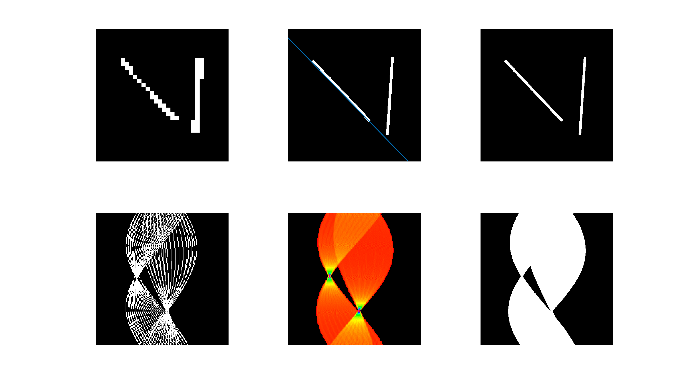
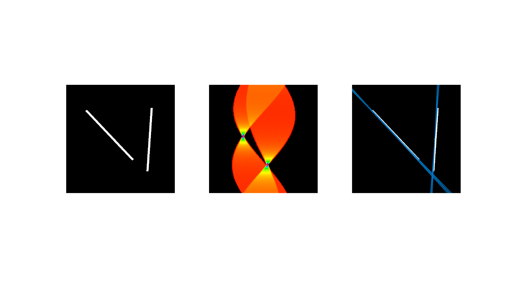
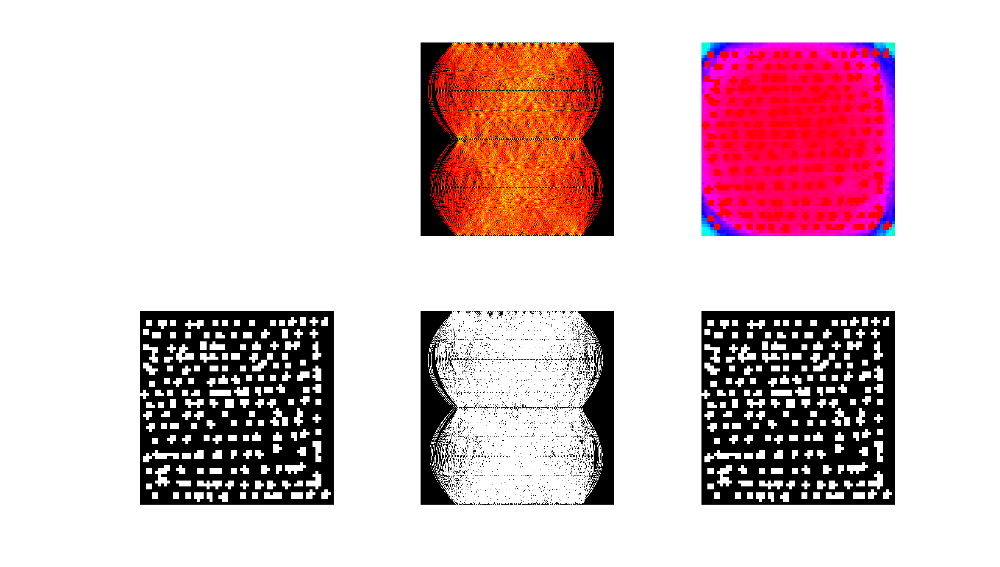
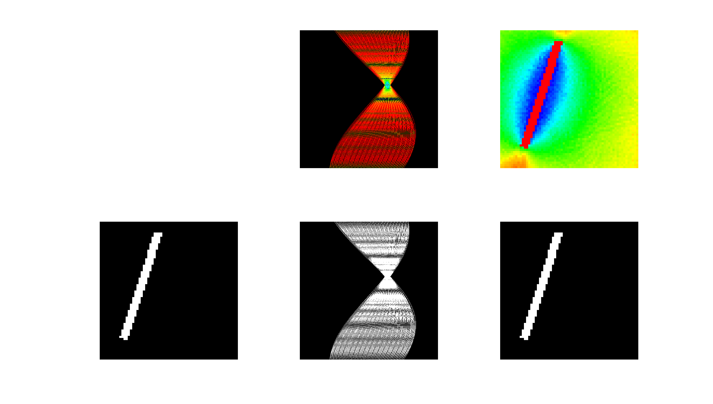
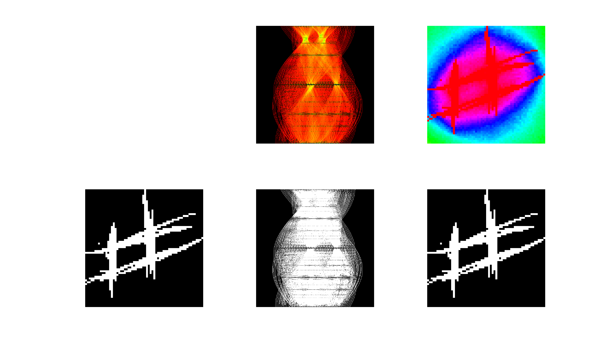
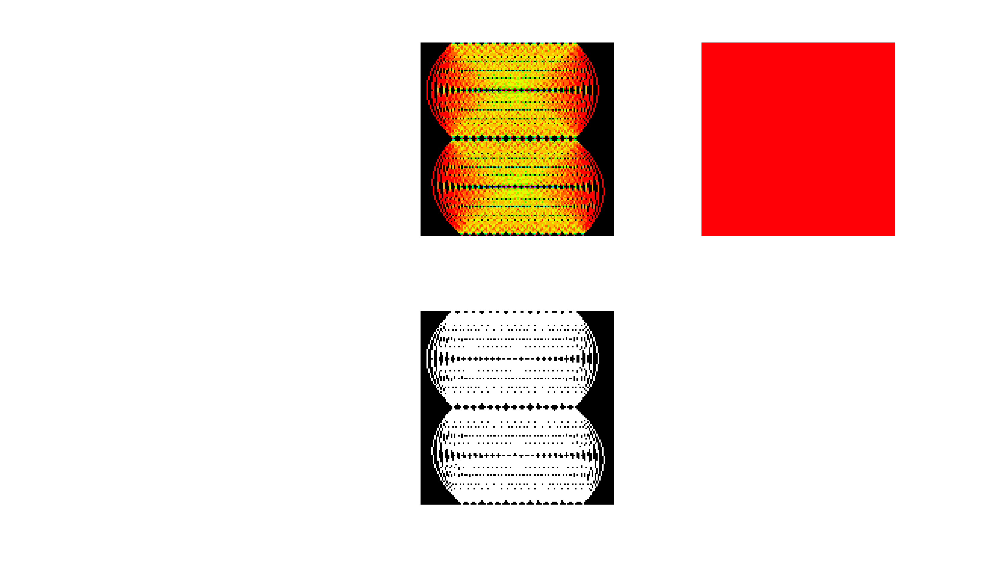
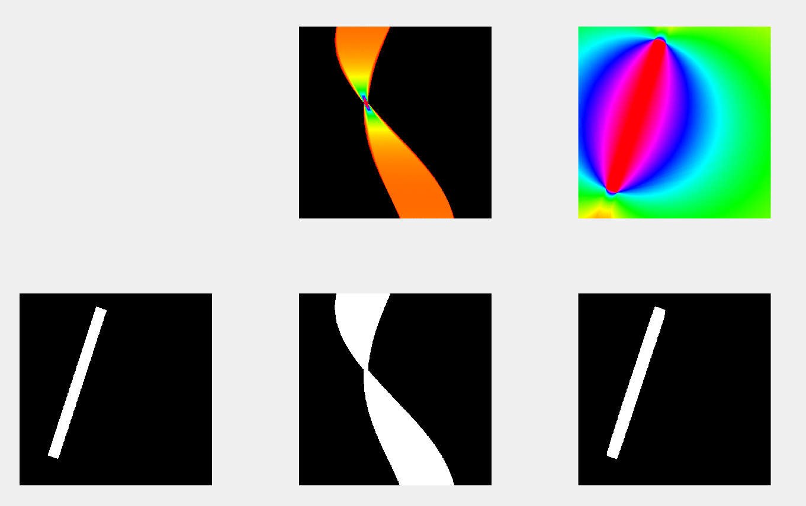
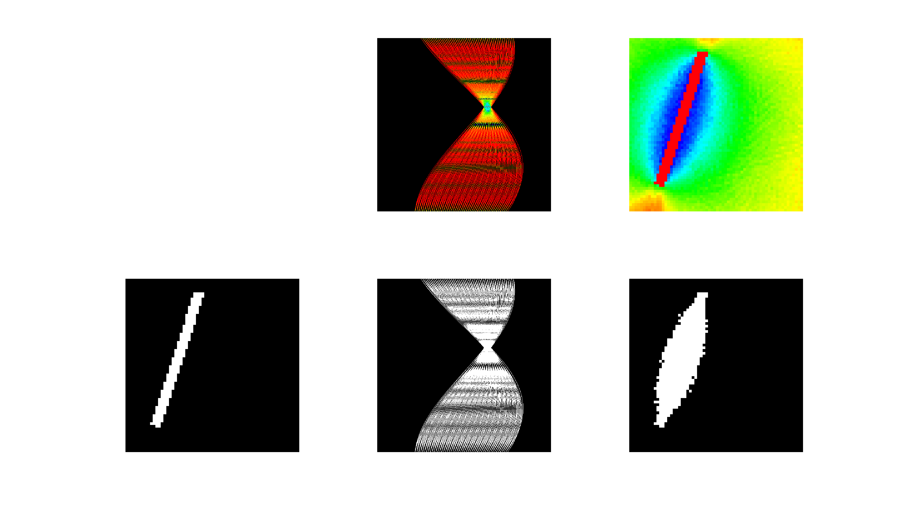

# ReverseHoughTransformation
Some ideas on reversing a hough transformation (done in Matlab)

- This was the result from a discussion in the digital image processing lecture at university
- The code is just brought to stage to show that restoring the original image (a black white image) from the hough tranformed image under some conditions 

## Execute

- The code is written with Matlab2018b.
- to reproduce the graphics execute one of the following files:
  - reverseHoughTest.m
  - lineDetector.m
  - houghTest.m

for changing the image: 

```
im1 = imread('../images/im1.png');
im2 = imread('../images/im2.png');
im3 = imread('../images/im3.png');
im4 = imread('../images/im4.png');
im5 = imread('../images/im5.png');

work_img = im5; % change image here 
```

change the assigned image to **work_img**.
only **work_img** is used in the script.

## Normal Hough Transformation

- Using the image center as base point for each possible line
- keep alpha in the range from -pi/2 to pi/2

## How the reverse Hough Transformation is realized

- loop over each pixel in an empty image *orig_img*
- loop over all alpha values defined in the provided hough image
  - range -pi/2 to pi/2 dividede by hough_img size
- calculate for current pixel (*x,y*) and current alpha the distance value (*dist*) from center point (*C*)

- Check if the pixel (alpha,distance) increase confidence value
  - add a normalized value to confidence
  - sum up condifdence for each alpha value
  - confidence value is a value how probably this pixel was set in the orignal value
- bring confidence value in range 0-255
- set this value into the empty "original" image (*orig_img*)

```
orig_img = zeros(orig_size);
    
C = (orig_size')/2;
max_dist = norm((orig_size+[1 1])./2);

alpha_steps = size(hough_img,1);
dist_steps = size(hough_img,2);

for x = 1:orig_size(1)
    for y = 1:orig_size(2)
        
        confidence = 0;
        
        for a = 1:alpha_steps
            alpha = (a/alpha_steps * pi) - pi/2;
            P = [x;y];
            norm_from_alpha = [-sin(alpha) cos(alpha)];                 
            dist = norm_from_alpha * (C-P);
            dist = (dist+max_dist)/(2*max_dist); % normalize
            img_dist = round( dist * dist_steps)+1; % +1 because 1 indexing
            if hough_img(a,img_dist) > 0
                confidence = confidence + 1/alpha_steps; 
            end
        end
        
        % create grey image from confidence
        % 0 <= confidence <= 1
        orig_img(x,y) = round(confidence * 255);

        % idea to return black-white image
        %if confidence > 0.9
        %    orig_img(x,y) = 1;
        %end
    end
```


## Examples for the Hough Transformation

---

- **top**: 
    - **left**: original black-white image downsized
    - **middle**: original image with a line derived from the max value in the hough image
    - **right**: original black-white
- **bottom**:
    - **left**: black-white hough image
    - **middle**: colored hough image
    - **right**: down-sized hough image black-white

---

1.)


---

2.)



## Examples for the Reverse Hough Transformation

---

- **top**: 
    - **middle**: colored hough image
    - **right**: colored condifdence values
- **bottom**:
    - **left**: original black-white image
    - **middle**: black-white hough image
    - **right**: original image restored from hough image (**for confidence = 1**)

---

1.)


---

2.)


---

3.)


---

4.) (white part is a fully filled white image)


---

5.)



---

- **top**: 
    - **middle**: colored hough image
    - **right**: colored condifdence values
- **bottom**:
    - **left**: original black-white image
    - **middle**: black-white hough image
    - **right**: original image restored from hough image (**for confidence = 0,59**)

##### => so restored image not a 100% match


---




---

## What else

- **resize the image to a different size is very difficult**
  - high confidence score is necessary for correct restoring
  - but because the resized image doesn't match perfectly the pixels in the hough image
  => restoring is bad or not possible